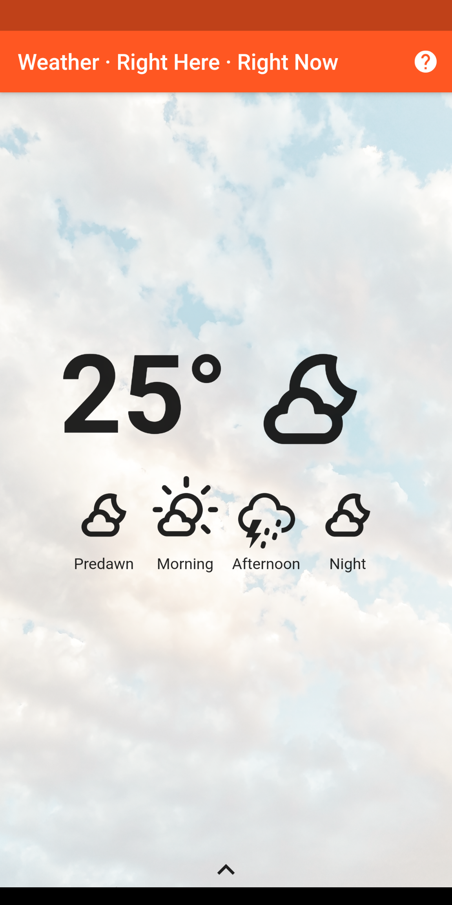

# Weather · Right Here · Right Now

This app shows the weather at your current location. *Works in Singapore only*.

## Requirements

Runs on Android 9 (Pie) or newer.

Requires location and internet access.

## Build

It is strongly recommended to use either [Android Studio](https://developer.android.com/studio) or [Visual Studio Code](https://code.visualstudio.com/). You will need to install the Dart, Flutter, and Flutter Intl plugins / extensions.

Use the latest [Flutter SDK](https://flutter.dev/docs/get-started/install).

Before launching the app in the IDE, run `flutter packages pub run build_runner build` to generate files used for serialization and dependency injection. If you encounter errors, try appending the flag `--delete-conflicting-outputs`.

## Usage

Pull downwards to refresh data.

Use the drawer at the bottom (drag upwards) to reveal weather details.

## Acknowledgement

[Data.gov.sg](https://data.gov.sg/) datasets licensed under [Singapore Open Data License](https://data.gov.sg/open-data-licence). Access via API is subject to [API Terms of Service](https://data.gov.sg/privacy-and-website-terms#api-terms).

[Weather Icons](https://erikflowers.github.io/weather-icons/) licensed under [SIL OFL 1.1](http://scripts.sil.org/OFL).

[Unsplash](https://unsplash.com) photos licensed under [Unsplash License](https://unsplash.com/license) from the following contributors:
- [David Moum](https://unsplash.com/@davidmoum?utm_source=unsplash&utm_medium=referral&utm_content=creditCopyText)
- [Eric Muhr](https://unsplash.com/@ericmuhr?utm_source=unsplash&utm_medium=referral&utm_content=creditCopyText)
- [Fabio Neo Amato](https://unsplash.com/@cloudsdealer?utm_source=unsplash&utm_medium=referral&utm_content=creditCopyText)
- [Guillaume M.](https://unsplash.com/@guimgn?utm_source=unsplash&utm_medium=referral&utm_content=creditCopyText)
- [Jason Briscoe](https://unsplash.com/@jsnbrsc?utm_source=unsplash&utm_medium=referral&utm_content=creditCopyText)
- [Peyman Farmani](https://unsplash.com/@peymanfarmani?utm_source=unsplash&utm_medium=referral&utm_content=creditCopyText)

This app is developed using [Flutter](https://flutter.dev) and includes the following third-party libraries:
- [build_runner](https://pub.dev/packages/build_runner)
- [flutter_markdown](https://pub.dev/packages/flutter_markdown)
- [geolocator](https://pub.dev/packages/geolocator)
- [http](https://pub.dev/packages/http)
- [intl](https://pub.dev/packages/intl)
- [json_annotation](https://pub.dev/packages/json_annotation)
- [json_serializatble](https://pub.dev/packages/json_serializable)
- [kiwi](https://pub.dev/packages/kiwi)
- [kiwi_generator](https://pub.dev/packages/kiwi_generator)
- [package_info](https://pub.dev/packages/package_info)
- [rubber](https://pub.dev/packages/rubber)
- [url_launcher](https://pub.dev/packages/url_launcher)
- [weather_icons](https://pub.dev/packages/weather_icons)

## Privacy policy

This app itself *does not* collect any private data.

The app uses [Data.gov.sg](https://data.gov.sg/) (see relevant [Privacy Statement](https://data.gov.sg/privacy-and-website-terms#privacy)).

## License

This app is released under [The MIT License](https://opensource.org/licenses/MIT).
